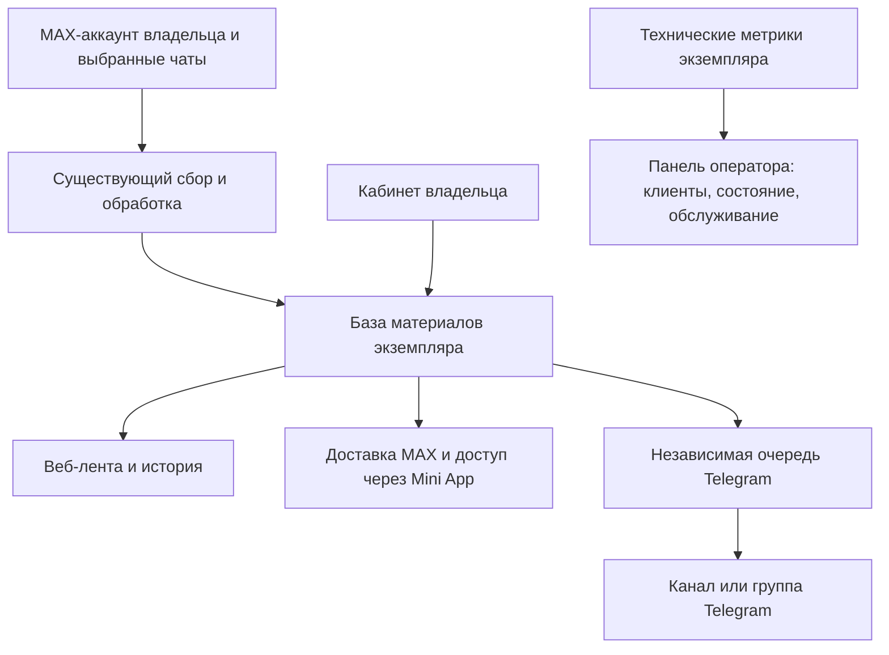

# Smart Leads: отдельные экземпляры, самостоятельная настройка и обслуживание

Дата: 14.09.2026. Документ объединяет требования текущего обсуждения и двух доступных предыдущих задач о коммерческой версии. Это целевая спецификация; перечисленные будущие функции не считаются реализованными.

## 1. Продукт

Покупатель получает отдельное приложение под своим названием, например «Новости дня». Сам подключает MAX-аккаунт для чтения источников, MAX-бота, чаты, категории и фильтры. По желанию подключает Telegram-бота и канал или группу для публикаций. Обычные пользователи читают материалы в MAX, Telegram и веб-приложении.

Общий код выпускается и обновляется централизованно. Отличия клиентов хранятся в настройках. Для каждой установки выделяются собственные база PostgreSQL, секреты, сессии аккаунтов, файловое хранилище, домен и резервные копии. Отдельный экземпляр не обязательно означает отдельный физический сервер; размещение нескольких установок на VPS требует раздельных ресурсов и ограничения нагрузки.

Для первой версии сохраняется существующее Next.js-приложение с PostgreSQL и Python-парсером. Новые функции добавляются отдельными модулями вокруг сохранённого ядра. Разделяются ответственность за сбор, представление материала и доставку; общая модель материала устраняет дублирование между каналами. Это применение SOLID, DRY и KISS без преждевременного перехода к общей базе организаций.

Mini App использует веб-приложение и его данные. Вход в браузере и вход из мессенджера должны приводить к серверной учётной записи с проверенными правами. Чтение Telegram-канала не требует регистрации в веб-приложении; регистрация нужна для функций самого приложения.

## 2. Ответственность и доступ

| Участник | Что делает |
| --- | --- |
| Оператор сервиса — продавец | Разворачивает установки, подключает домен и HTTPS, следит за ресурсами, обновлениями, резервными копиями, восстановлением и оплатой обслуживания |
| Владелец экземпляра — покупатель | Меняет бренд, подключает аккаунты и ботов, выбирает источники и получателей, задаёт категории, фильтры, доступ читателей и уведомления |
| Читатель | Входит в свой кабинет, читает разрешённые материалы, ищет по истории, выбирает категории и настройки уведомлений |

Читатель не получает административные API, токены и сессии источников. Ссылка на источник материала и доступ к настройке источника — разные права. Владелец не получает панель VPS или соседние установки.

Панель оператора показывает сводные показатели и не требует передачи текстов сообщений, телефонов, токенов или MAX-сессий. При этом администратор инфраструктуры технически способен получить доступ к данным сервера; разделение интерфейсов не устраняет эту возможность. Диагностические действия должны протоколироваться.

## 3. Самостоятельный первый запуск

1. Оператор создаёт экземпляр из шаблона, задаёт домен, ресурсы и параметры обслуживания. Технические секреты генерируются отдельно для установки.
2. Система создаёт одноразовое приглашение владельцу с ограниченным сроком. Приглашение доставляется конкретному покупателю, а не публикуется на открытой странице.
3. Покупатель активирует ограниченную установочную сессию, задаёт название, логотип и подключает бота. Первоначальный доступ не должен зависеть от ещё не подключённого бота.
4. После подключения покупатель подтверждает свою личность через поддерживаемый вход. Назначение первого владельца и погашение приглашения выполняются атомарно. Ввод произвольного MAX ID сам по себе не даёт административных прав.
5. Подключает аккаунт MAX через существующую форму, добавляет чаты, выбирает категории и текущий режим обработки.
6. При необходимости подключает Telegram, выбирает канал или группу и категории для публикации. Мастер показывает результат проверки доступа и тестовой отправки.
7. Проверяет материал в ленте и выбранных каналах, затем приглашает читателей.

Токены вводятся в защищённые поля владельца, хранятся зашифрованно и возвращаются в интерфейс только маскированными. Настройки должны показывать этапы подключения и понятную причину ошибки. Повторный запуск мастера не создаёт второго владельца и не сбрасывает рабочие подключения.

Технические параметры базы, шифрования, фоновых задач и резервных копий остаются у оператора. Ключи дополнительных платных интеграций можно сделать настройками владельца; включённые в обслуживание ресурсы должны иметь явные ограничения.

## 4. Новости и лиды

Продукту нужны два режима представления: «Новости» и «Лиды». В новостном режиме пользователь читает полный разрешённый материал, использует категории, поиск, даты и историю. Покупка контакта и баланс не должны быть обязательными шагами чтения. В режиме лидов сохраняются действующие сценарии покупки и доступа.

Текущая выдача `/api/leads` связана со статусом `NEW`, скрытием контактов и ограниченным количеством записей. Её нельзя считать готовой историей новостей. Для истории требуется пагинация с устойчивым порядком, поиск и явные правила хранения и доступа. «Вся история» означает сохранённые и разрешённые к показу материалы, а не обещание извлечь все прошлые сообщения MAX-чата.

Новостной режим не меняет автоматически правила защищённого парсера. Сейчас категория без совпадения может стать «Другое»; ранее предложенный строгий отбор был отменён пользователем. Новое требование к отбору сначала сопоставляется с существующим поведением.

## 5. Telegram и вложения

Вход через Telegram и публикация в Telegram — отдельные функции. Подключение канала не создаёт учётную запись читателя и не назначает ему роль владельца.

Для входа требуется модель внешних идентификаторов с уникальностью пары «провайдер + идентификатор». Нельзя использовать фиктивный MAX ID для пользователя Telegram или объединять аккаунты по совпадению имени. Привязка второго способа входа требует подтверждения обеих учётных записей.

Telegram получает отдельную очередь доставки: состояние, число попыток, следующая попытка, причина ошибки, идентификатор получателя и опубликованного сообщения. Сбой Telegram не должен останавливать MAX и сохранение материала. Повторная постановка события должна исключаться уникальным ключом. Неопределённый результат отправки при обрыве соединения требует отдельной обработки; абсолютное отсутствие повторов внешней публикации нельзя обещать только на основании локальной очереди.

Изображения, видео, аудио и документы входят в ранее обсуждённый расширенный сценарий. Сейчас worker передаёт текст и ID. Модель вложений и загрузку можно подготовить отдельно, но автоматическое получение медиа из MAX пока не подтверждено. Изменение извлечения в `scripts/parser_worker.py` требует отдельного явного разрешения пользователя. До этого новостной пилот проверяется на тексте; поддержку автоматических медиа нельзя объявлять готовой.

## 6. Демо для продажи

Нужны два сценария на той же версии приложения, что поставляется клиенту:

- Ознакомительный доступ к настоящей ленте и кабинету с учебными материалами. Изменяемые настройки посетителей изолированы, внешние отправки и рабочие секреты недоступны. Интерфейс явно обозначает имитацию подключений, если она используется.
- Персональный пробный экземпляр, где потенциальный покупатель может подключить собственные аккаунты, ботов и тестовые чаты. Собственная база, секреты и срок действия. После завершения доступ отзывается, фоновые отправки останавливаются, данные и резервные копии удаляются по заранее указанным правилам хранения. Подключения и вебхуки освобождаются корректно.

Общая админка с единым аккаунтом для всех посетителей не подходит для личных токенов. Текущая статическая `/demo` — презентационный экран, а локальная `/api/dev/login` — вход разработчика. Ни одну из них нельзя выдавать за готовую публичную пробную установку. Отключение локального входа в production сохраняется.

Путь покупателя: рекламная страница → демонстрация → персональная проба при необходимости → заявка → согласование и оплата → рабочий экземпляр → самостоятельная настройка.

## 7. Панель оператора и ежемесячное обслуживание

Панель оператора — отдельный контур с собственным входом и базой реестра установок. Минимальная карточка клиента содержит:

- название, домен, идентификатор экземпляра и версию приложения;
- состояние сервиса и время последнего полученного отчёта;
- время последнего успешного сбора, количество материалов и пользователей;
- объём данных, очередь и ошибки доставки по каналам;
- дату последней резервной копии и проверки восстановления;
- тариф обслуживания, оплаченный период и статус счёта.

Метрики передаются по защищённому соединению с отдельным отзываемым ключом установки. Отсутствие свежего отчёта отображается как неизвестное состояние. Недоступность панели оператора не останавливает сбор и чтение новостей. Сбор статистики не требует прямого подключения центральной панели к базам клиентов.

Коммерческая модель: разовый платёж за запуск и право использования экземпляра плюс ежемесячная плата за согласованное обслуживание. Учёт этих платежей отделяется от уже существующих покупок лидов и подписок читателей внутри клиентского приложения. На старте оператор может подтверждать оплату вручную; автоматический биллинг добавляется отдельным этапом.

Размер платы определяется после измерения ресурсов пилота: хостинг, хранение и резервные копии, внешние сервисы, поддержка и запас на обслуживание. Точные суммы, сроки льготного периода и правила при задолженности пока не утверждены. Истечение оплаченного периода не должно автоматически удалять клиентские данные.

## 8. Фактическое состояние на 14.09.2026

| Область | Состояние и подтверждение |
| --- | --- |
| Коммерческая основа | Рабочая папка `commercial`, локальная PostgreSQL и настоящая админка; предыдущая задача содержит проверку входа |
| Бренд | Реализованы `/admin/branding`, публичные настройки и оформление интерфейса |
| Парсер, аккаунты и MAX-цепочка | 12 защищённых файлов повторно проверены в текущей задаче: совпадают с исходными SHA-256 |
| Тесты приложения | Последний отчёт `verification-2026-09-14.md`: 121/121, типы и сборка успешны; в текущей задаче эти проверки заново не запускались |
| Прокси | По последнему изменению предыдущей задачи оставлена только кнопка пошаговой диагностики; ранний отчёт описывает промежуточные две кнопки |
| Права владельца | Сейчас административный доступ зависит от `ADMIN_MAX_IDS`; самостоятельное назначение владельца через мастер отсутствует |
| MAX-бот | Токен и имя читаются из серверного окружения; самостоятельная настройка через кабинет ещё не завершена |
| Telegram | Вход и доставка отсутствуют |
| Новости | Есть основа ленты лидов; полноценные новостные правила доступа, поиск и история требуют доработки |
| Демо | Есть презентационная страница и локальный рабочий вход; публичная персональная проба отсутствует |
| Оператор и обслуживание | Общая панель клиентов и отдельный учёт ежемесячной платы отсутствуют |

## 9. Порядок выполнения и критерии готовности

| Этап | Что реализовать или проверить | Критерий завершения |
| --- | --- | --- |
| 1. Приёмка MAX | Существующий аккаунт, контролируемый чат, сохранение, лента и бот | Пользователь подтверждает реальное сообщение по всей цепочке и повторный проход без новых дублей |
| 2. Владелец и установка | Разделение полномочий, приглашение, самостоятельное подключение и хранение настроек | Новый покупатель на чистой базе получает и настраивает свой кабинет; посторонний не может занять роль владельца |
| 3. Новостной кабинет | Режим «Новости», полный доступ по правилам владельца, поиск, категории и история | Читатель находит старую новость и не видит административных данных; режим лидов сохраняет поведение |
| 4. Telegram | Проверенный вход, независимая очередь, подключение получателя | Одна новость проходит в веб, MAX и Telegram; проверены отказ доступа, повтор события и временная ошибка |
| 5. Медиа | Модель хранения и доставки; отдельное решение по защищённому извлечению | Реальные вложения проходят заявленные каналы; ограничения явно отражены в составе выпуска |
| 6. Шаблон VPS | Воспроизводимое развёртывание, секреты, миграции, мониторинг, копии, обновление и восстановление | Новый экземпляр развёрнут с нуля, восстановлен из копии, обновлён по проверенной процедуре |
| 7. Панель оператора | Реестр установок, сводная статистика, оплаченный период | Видны несколько изолированных установок; потеря связи обозначается, их работа продолжается |
| 8. Приёмка продукта владельцем проекта | Полный сценарий клиента и читателя на подготовленной версии | Подтверждены выбранные для продажи функции, отсутствуют блокирующие дефекты |
| 9. Демо и продажи | Публичный доступ, персональная проба, заявка, тарифное описание, инструкция и материалы показа | Потенциальный клиент проходит пробу без вмешательства в чужие данные; поставка соответствует показанным функциям |

Проверки после изменений кода: релевантные поведенческие тесты, `npm test`, `npm run typecheck`, `npm run build`, `npm run verify:protected`. Перед поставкой — проверка приватных файлов и чистой установки на целевом Node.js 22. Локальная проверка на Node.js 25 не заменяет целевую среду.

## 10. Границы изменения ядра

Сохраняются последняя инструкция пользователя о неизменности подключения аккаунтов и парсера и контроль всех 12 защищённых файлов. Разработка Telegram, прав, демо и мониторинга не является разрешением менять ядро.

Самостоятельное подключение MAX-бота нужно согласовать с текущим чтением окружения и защищёнными потребителями настроек. До реализации выбирается совместимая схема конфигурации; если потребуется правка защищённого файла, сначала подготавливаются конкретное изменение и обоснование для отдельного разрешения. Проверка целостности не отключается и эталонные хеши ради прохождения проверки не переписываются.
